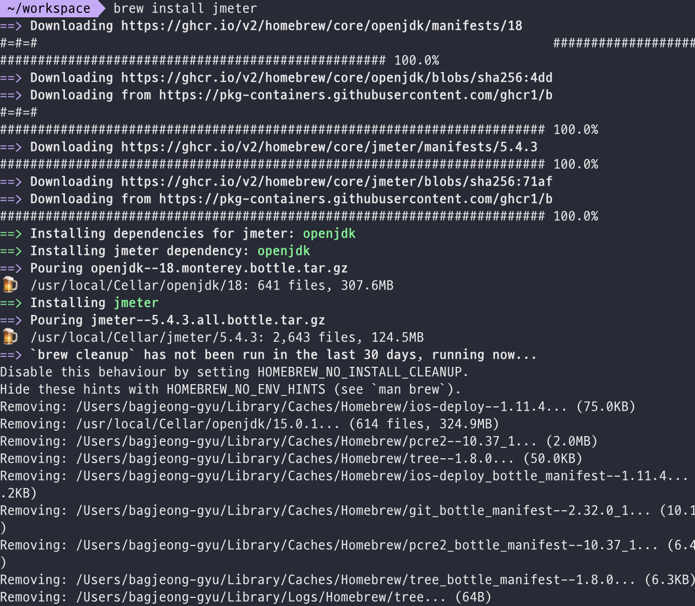
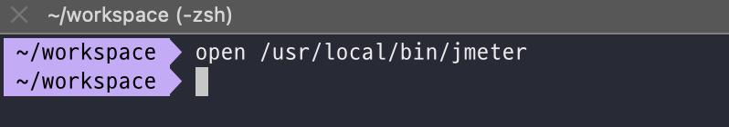
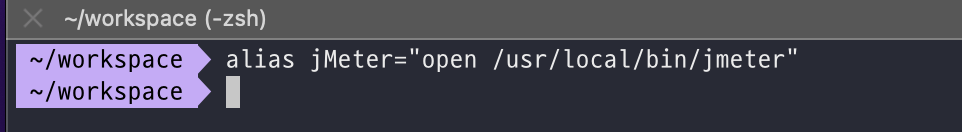

# jMeter 시작 하기

mac 의 경우 brew 을 이용해서 jMeter 설치

```bash
brew install jmeter
```

```bash
brew install jmeter —-with-plugins
```



# jMeter Open

jMeter 실행

```bash 
open /usr/local/bin/jmeter
```




alias 처리

```bash
alias jMeter="open /usr/local/bin/jmeter"
```


